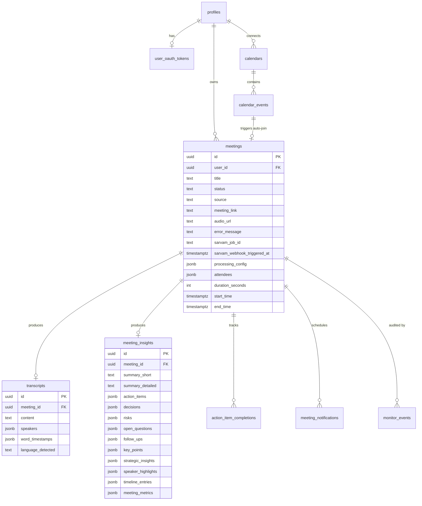

# Database

PostgreSQL on Supabase, with Row Level Security on every user-scoped table.

- [Entity model](#entity-model)
- [Core tables](#core-tables)
- [Integration tables](#integration-tables)
- [Operational tables](#operational-tables)
- [Row Level Security](#row-level-security)
- [Migrations](#migrations)
- [Regenerating types](#regenerating-types)

---

## Entity model



---

## Core tables

### `meetings`
The centre of the product model — it connects recording source, processing state,
transcript, insights, and delivery. Columns that carry pipeline semantics:

| Column | Role |
|---|---|
| `status` | The state machine: `scheduled` → `joining` → `recording` → `processing` / `transcribing` → `completed` \| `failed` \| `cancelled`. Free text, no enum — new states need no migration. |
| `error_message` | Human-readable failure reason surfaced in the UI. **Added late** — every failure-path UPDATE silently no-op'd for weeks before it existed. |
| `sarvam_job_id` | The Sarvam batch job this meeting is waiting on. |
| `sarvam_webhook_triggered_at` | Atomic recovery lock for `check-recall-status`. Deliberately **not** `status`. |
| `sarvam_webhook_claimed_at` | Atomic in-flight claim taken by `sarvam-webhook` on a terminal callback, so Sarvam's ~8 s callback retries skip instead of re-running the pipeline. Claims older than 10 min are re-claimable, so a died-mid-way run never strands a meeting. |
| `processing_config` | JSONB: `chunk_count`, `chunk_seconds`, `split_method`, `recall_speaker_timeline`, `recall_participants`, `entity_corrections` (audit log of spelling fixes). |
| `languages` | JSONB duration-weighted language mix, e.g. `{"en": 0.78, "hi": 0.22}`. Replaces trusting `transcripts.language_detected`. |
| `boundaries` | JSONB privacy-trim window: `first_external_join_ts`, `last_external_leave_ts`, `source` (`speech_estimated` \| `none`), `internal_only`. Insights, email and MCP default to this window. |
| `source` | How the meeting was captured / created. |

### `transcripts`
One row per meeting: `content` (full text), `speakers` (JSONB segment array with
`speaker`, `text`, `start`, `end`, plus `zone` (`pre` \| `meeting` \| `post`), `language`
(`en` \| `hi` \| `mixed` \| `unknown`) and `original_text` when the segment was translated),
`word_timestamps`, `language_detected`. Segments written before 2026-08-31 have no
`zone`; readers treat missing as `meeting`.

### `meeting_insights`
One row per meeting, insert-only in practice — `saveInsights` checks for an existing
row and no-ops. Regenerating insights means deleting the row first.

`meeting_metrics` is the merged object: everything computed in
[`_shared/metrics.ts`](../supabase/functions/_shared/metrics.ts) plus **only**
`sentiment_score` from the model, merged by whitelist. See
[Chat & analytics](chat-and-analytics.md#conversation-metrics).

`facts` (JSONB) is the pass-1 extraction object — numbers, objections, commitments,
explicit asks, decisions, topics, each with a verbatim `quote` and `ts`, plus
`meeting_type` and `validation.unverified`. `coaching` (JSONB) is the per-meeting
coaching report (metric verdicts, moment flags, `sentiment_timeline`, summary); null for
internal-only meetings and for rows written before the pass existed. Action items in
`action_items` may carry `due_date_resolved` (ISO date) or `due_date_range`.

### `profiles`
User settings and integration flags: `auto_join_enabled`, `email_summaries_enabled`,
`notetaker_name`, `bot_color`, `preferred_languages`, `onboarding_completed`,
`pre_meeting_notification_minutes`, `google_calendar_connected`, `custom_vocabulary`
(`text[]` — canonical spellings enforced by the entity-correction pass; edited in
Settings → Custom vocabulary).

### `action_item_completions`
Per-user completion state for an action item, addressed by
`(meeting_id, action_item_index)` — the action items themselves live in the
`meeting_insights.action_items` JSONB array.

---

### `contacts` / `meeting_contacts`
External attendees (email domain ≠ owner's) of every completed meeting, one row per
`(user_id, email)`, with `name` / `company` guessed from the address and never
overwritten once set, `meeting_count`, first/last seen, and the cached `account_brief`
JSONB (`where_it_stands`, open commitments both ways, unresolved objections, key
numbers, next-call prep). `meeting_contacts` is the link table. Written by
`_shared/contacts.ts` with the service role; owners can read, rename and delete.

### `webhook_events`
One row per outbound automation delivery (`meeting.insights_ready`,
`meeting.insights_regenerated`): payload, HTTP status or error, `delivered_at`.
The endpoint and secret live on `profiles.webhook_url` / `webhook_secret`.

## Integration tables

| Table | Purpose |
|---|---|
| `user_oauth_tokens` | Google access/refresh tokens and expiry |
| `google_oauth_states` | CSRF state + `return_to` for the OAuth round trip |
| `calendars` | Connected calendars per user, with sync flags and `last_synced_at` |
| `calendar_events` | Synced events, including `meeting_link` extraction that drives auto-join |
| `meeting_notifications` | Scheduled pre-meeting notifications |
| `waitlist` | Signup waitlist capture |
| `digest_reports` / `digest_schedules` | Digest generation and cadence |
| `scheduled_emails` / `email_messages` | Delivery queue and log |

**Removed 2026-08-20:** `slack_messages`, `notion_connections`, and the Slack columns
on `profiles` — see migrations `20260820130000_remove_slack.sql` and
`20260820140000_remove_notion.sql`. Notion is not coming back. **Slack did**, on a
different schema, on 2026-09-08 (see below); nothing from the removed shape was
revived.

### `slack_connections`
One Slack workspace install per user (UNIQUE on `user_id`, which is what makes
"connected" the existence of the row rather than a boolean that can disagree with it).
`access_token` / `refresh_token` are AES-256-GCM sealed by `_shared/oauth-tokens.ts` —
the columns are named to match `calendar_connections` so the same sealer applies
unchanged. `channel_id` / `channel_name` are null until the user picks a destination:
connecting a workspace and choosing where summaries land are two separate decisions,
and there is no safe default channel. RLS: **SELECT own row only** — every write goes
through `manage-slack` or `slack-oauth-redirect` with the service role, because a
browser must never be able to UPDATE a token column.

The three failures of the removed integration are structurally impossible here: the
token belongs to the row rather than to one global `SLACK_BOT_TOKEN`, the channel comes
from a picker backed by `channels:read`, and Disconnect deletes the row.

### `slack_deliveries`
Claim-before-send ledger, UNIQUE on `(meeting_id, channel_id)` — the same shape as
`email_deliveries` and for a sharper reason. `afterInsightsSaved` runs on every
completion path *including regeneration*, and Sarvam has replayed a single callback
three times; without the claim, regenerating a three-week-old meeting re-posts it. A
duplicate email annoys one inbox, a duplicate Slack message is visible to the whole
channel and cannot be unsent. `message_ts` is null until the post succeeds, so a
claimed-but-failed row is distinguishable from a sent one, and `error` records why.
Service-write, user-read.


### `zoho_connections`
One Zoho CRM org per user (UNIQUE on `user_id`). Access and refresh tokens are sealed
by `_shared/oauth-tokens.ts`. RLS: **SELECT own row only** — writes go through
`manage-zoho` or `zoho-oauth-redirect` with the service role.

**`api_domain` is a column, not a constant, and that is the whole point.** Zoho runs
independent datacentres that share nothing: an India account authorises at
`accounts.zoho.in` and its tokens work only against `www.zohoapis.in`. A token used
against the wrong domain fails as an ordinary auth error, so a hardcoded domain passes
every test written against our own account and breaks for every customer elsewhere. The
domain arrives with the grant and is stored next to the tokens that are only valid
there; `location` keeps the short DC code for the refresh call.

Access tokens last one hour — shorter than the gap between most people's meetings — so
refreshing is the normal path. A refresh never returns a new refresh token, so only the
access token and its expiry are written back.

### `zoho_deliveries`
Claim-before-write ledger, UNIQUE on `(meeting_id, record_id)`: one note per meeting per
CRM record, while a meeting with two external attendees can still write to both. Same
reasoning as `email_deliveries` and `slack_deliveries`, one notch sharper — a Contact
carrying four identical notes from a regenerated meeting discredits every other thing
the product writes into that CRM. `note_id` is null until the write succeeds and `error`
records why it did not; `matched_email` makes "why did this land here?" answerable
without re-running the match.

---

## Operational tables

### `meeting_observers`

Read-only grants for allowlisted reviewers who were on a meeting's invite. Primary key
`(meeting_id, user_id)`; `email` and `reason` are kept for the audit trail, because
"why can this account see this meeting?" has no answer anywhere else once a profile
email changes.

Written by `_shared/observers.ts` from `afterInsightsSaved` (and by
`scripts/backfill_meeting_observers.py` for meetings that predate it), using exactly the
rule that already decides the reviewer email copy: on
`summary_recipient_allowlist` with `dashboard_access = true`, **and** on this meeting's
attendee list, minus the owner. The grant is materialised rather than computed in a
policy so RLS stays a primary-key lookup instead of re-deriving three attendee shapes on
every row of every query.

Policies grant SELECT and nothing else, on `meetings`, `meeting_insights` and
`transcripts`, through the `SECURITY DEFINER` helper `i_observe_meeting(uuid)`. Unlike an
org share this one **does** reach the transcript — an observer was in the room, so the
pre/post-call zones the org share protects are zones they were present for. An observer
cannot delete, regenerate, rename, re-share or edit anything, in the database or in the
UI.

### `monitor_events`
Audit trail of every stuck-meeting detection. **Service-role only** — no user-facing
RLS policy. Deduped by a generated `hour_bucket` column so a persistently stuck
meeting produces one row per signature per hour rather than one per cron tick.

This is what the pipeline harness asserts against, because the alert email itself is
suppressed for test meetings.

### `email_deliveries`
One row per summary email that has been sent, keyed
`(meeting_id, lower(recipient_email), kind)` by a **unique index**. **Service-role
only.** `send-meeting-email` INSERTs the row before it calls Resend, so a racing
caller gets `23505` and skips instead of sending a second copy; the row is deleted
again if the send then fails, so a retry can still deliver. `kind` keeps the
automatic `meeting_summary` separate from other mail, so a manual re-send is never
blocked by the automatic one.

Added 2026-08-21 after Sarvam replayed one callback three times and the user
received three identical summaries — see [`engineering-notes.md`](engineering-notes.md) #24.

---

## Row Level Security

Every user-scoped table enforces `auth.uid() = user_id`. This is the real access
control, not a convenience: the anon key is shipped to the browser by design, so
Postgres is the only thing standing between one user's session and another user's
meetings.

Two consequences worth internalising:

- **`chat-transcripts` uses the caller's JWT**, not the service role. Chat is the one
  feature where a scoping bug leaks another user's private meeting content, so the
  guarantee belongs in Postgres rather than in an application-level filter that a
  future refactor could drop.
- **Edge Functions using the service role bypass RLS entirely.** Any new function
  that filters by `user_id` in application code is one forgotten `.eq()` away from a
  leak. Prefer the caller's token wherever the operation is genuinely user-scoped.

---

## Migrations

Migrations live in [`supabase/migrations/`](../supabase/migrations/) and are applied
in filename order. The ones that carry non-obvious history:

| Migration | What it fixed |
|---|---|
| `20260314010000_sarvam_migration.sql` | Adds `sarvam_job_id`, `processing_config` |
| `20260422170000_sarvam_webhook_trigger_lock.sql` | Adds `sarvam_webhook_triggered_at`, decoupling recovery from the `transcribing` sentinel |
| `20260424170000_meetings_error_message.sql` | Adds `error_message` — the column every failure path had been writing to for weeks without it existing |
| `20260425170000_monitor_events.sql` | Monitor audit trail |
| `20260425170100_monitor_stuck_meetings_cron.sql` | Monitor cron schedule |
| `20260613120000_reduce_cron_frequency.sql` | Auto-join 1→5 min, monitor 5→15 min. Those `net.http_post` calls were **94.4% of all DB execution time** and were depleting the Disk IO Budget |
| `20260613120100_prune_cron_pgnet_bookkeeping.sql` | Daily prune of `cron.job_run_details` + `net._http_response` |
| `20260820150000_autojoin_dedup_unique_index.sql` | Unique index that makes duplicate-bot dispatch impossible rather than merely unlikely |
| `20260820160000_prune_recordings_cron.sql` | Daily audio prune after the storage cap incident |
| `20260821180000_email_delivery_dedup.sql` | `email_deliveries` claim table + `meetings.sarvam_webhook_claimed_at`. Makes three identical summary emails for one meeting impossible rather than merely unlikely |
| `20260831130000_production_quality.sql` | `meetings.languages` / `boundaries`, `meeting_insights.facts` / `coaching`, `profiles.custom_vocabulary` — the columns behind language mix, privacy trim, two-pass insights and coaching |
| `20260831160000_production_quality_2.sql` | `contacts` + `meeting_contacts` (CRM v1), `webhook_events` + `profiles.webhook_url` / `webhook_secret` (automation), `meeting_insights.followup_draft` |
| `20260908090000_slack_connections.sql` | `slack_connections` (sealed per-user bot token, one row per user) + `slack_deliveries` (claim-before-send). Slack's second attempt, on a schema where the three failures that got it removed in August cannot recur |
| `20260908160000_zoho_connections.sql` | `zoho_connections` (sealed tokens **plus the datacentre domain they are valid in**) + `zoho_deliveries` (one note per meeting per CRM record) |
| `20260908180000_team_seats.sql` | `profiles.subscription_quantity` — the paid seat count behind per-seat Teams pricing. NULL on every flat-priced plan; `seatsForProfile` reads NULL as 1 so a misconfigured account degrades to one seat rather than to unlimited |
| `20260909140000_meeting_observers.sql` | `meeting_observers` + `summary_recipient_allowlist.dashboard_access` — an allowlisted reviewer on the invite sees the meeting in their own dashboard, not just in their inbox |
| `20260909150000_one_share_link.sql` | `meeting_shares.token_sealed` — the share token sealed with `TOKEN_ENCRYPTION_KEY` so the owner can see their own link again. One live link per meeting from here on, enforced in `manage-meeting-share`, not by an index: existing links are neither revoked nor broken |

`cron.schedule()` with an existing job name **updates that job in place** — that is
why the frequency migrations re-declare the jobs rather than unscheduling first.

---

## Regenerating types

`src/integrations/supabase/types.ts` is generated and drifts. Regenerate after any
migration:

```bash
supabase gen types typescript --project-id <project-id> > src/integrations/supabase/types.ts
```

> As of this writing the checked-in types are behind the schema — they omit
> `meetings.error_message`, `sarvam_job_id`, `sarvam_webhook_triggered_at`,
> `processing_config`, and the `monitor_events` / `digest_reports` tables. Edge
> Functions do not use this file, so nothing is broken; frontend code touching those
> columns will need a regenerate first.
